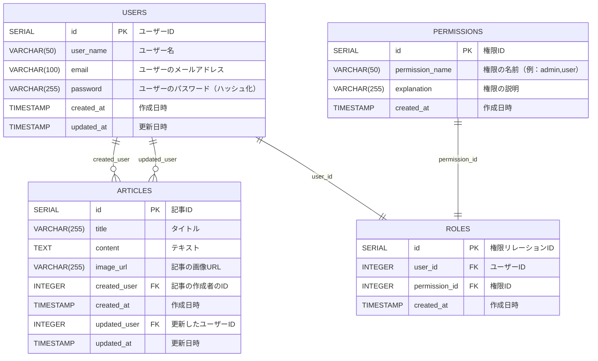

```mermaid　
erDiagram
    USERS {
        SERIAL id PK "ユーザーID"
        VARCHAR(50) user_name "ユーザー名"
        VARCHAR(100) email "ユーザーのメールアドレス"
        VARCHAR(255) password "ユーザーのパスワード（ハッシュ化）"
        TIMESTAMP created_at "作成日時"
        TIMESTAMP updated_at "更新日時"
    }

    ARTICLES {
        SERIAL id PK "記事ID"
        VARCHAR(255) title "タイトル"
        TEXT content "テキスト"
        VARCHAR(255) image_url "記事の画像URL"
        INTEGER created_user FK "記事の作成者のID"
        TIMESTAMP created_at "作成日時"
        INTEGER updated_user FK "更新したユーザーID"
        TIMESTAMP updated_at "更新日時"
    }

     PERMISSIONS {
        SERIAL id PK "権限ID"
        VARCHAR(50) permission_name "権限の名前（例：admin,user）"
        VARCHAR(255) explanation "権限の説明"
        TIMESTAMP created_at "作成日時"
    }

    ROLES {
        SERIAL id PK "権限リレーションID"
        INTEGER user_id FK "ユーザーID"
        INTEGER permission_id FK "権限ID"
        TIMESTAMP created_at "作成日時"
    }

    USERS ||--o{ ARTICLES : "created_user"
    USERS ||--o{ ARTICLES : "updated_user"
    USERS ||--|| ROLES : "user_id"
    PERMISSIONS ||--|| ROLES : "permission_id"

```